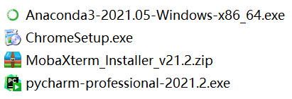
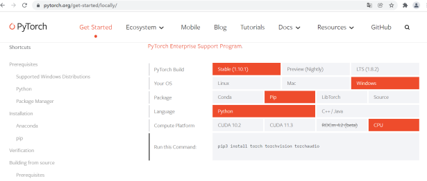

# 开始
## Windows
* 安装四件套 \
 \
* 点击开始菜单-Anaconda3-Anaconda Prompt，出现命令行窗口，形式为(base)
 C：xxx\xxx；
* 命令行操作为输入命令，回车确认命令。在窗口敲下伟大的六个字母：python，回车确认，即进入到安装anaconda时所选择的基础python环境
* 输入以下命令确认平台信息并用Ctrl+D退出：
```
import sys
sys.version
sys.platform
```
* Anaconda命令形式为conda xxx
```
conda -h #可以查看命令关键词
conda info #查看当前环境信息
conda info -e #查看安装环境的路径
conda create -n 环境名字 python=版本号 #得到新环境
conda activate 环境名字 #激活当前环境
conda deactivate #退出当前环境。
conda install/list# 安装/列举库
```
* 修改镜像源
```
pip installl pqi #
pqi ls #查看可用的镜像源
pqi use tuna #切换至tuna镜像源
```
* pip install 命令格式为pip install xxx==version，xxx为库的名字，version为其版本号。安装库的形式有离线和在线两种形式。

## 在线安装
* 以pytorch为例，进入官网https://pytorch.org/ 在Get Started菜单查看相应安装命令，如下图所示。\
 \

  在网址https://download.pytorch.org/whl/xxx/torch_stable.html 可在下载不同python版本所需的.whl。其中，xxx=cpu即cpu版本，xxx=cu{}表示cuda版本，cuda版本号为{}，如cuda 11.0表示为xxx=cu110。
常用库安装命令示例如下：
```
pip install numpy
Pip install opencv-python
pip install scikit-image
```

安装成功后。输入python，进入python环境。输入如下命令：
```angular2html
import torch
# 查看安装后的torch版本信息和所在路径。
torch.__version__
torch.version.cuda
torch.__file__；
# 如果安装的是gpu版本，输入torch.ones(3,3).cuda()查看是否能将数据加载至cuda。如果报错，说明安装的cuda版本和机器不匹配。
```
## 离线安装

假设你的工程根目录为demos且需要导出工程所用的库以便在其他机器上使用。首先
```angular2html
pip install pipreqs
pipreqs --force ./ #在当前根目录下执行，生成requirements.txt，其包含了当前工程所用的库
pip install -r requirements.txt #安装相应的库
```
如果其他机器无法联网，则首先使用命令
```angular2html
pip download --platform anylinux_x86_64 --no-deps -d path -r ./requirements.txt #下载requirements.txt所包含的库至path中
# 在其他机器上
pip install --no-index --find-links=whls_path -r reqs_path/requirements.txt #whls_path是指包含库的文件夹路径，reqs_path是指requirements.txt路径。
```
