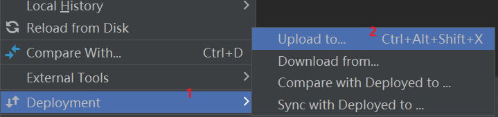

## 远程连接
* 本文介绍三种远程连接方法，分别是MobaXterm、Jupyter、Pycharm
### MobaXterm
* 点开MobaXterm，按照图中的数字顺序进行操作。第一次登录会要求输入服务器密码，命令行不会回显密码，复制粘贴（在命令行单击右键，不是ctrl+v）回车就行。 \

### Jupyter
#### 打开本地环境
* 点击开始菜单-Anaconda3-Anaconda Prompt，在命令行输入
```angular2html
    cd your_path 切换至你的工程目录
    jupyter notebook #启动jupyter，一般网址为http://localhost:8888/tree，8888为端口号。
```
#### 连接服务器
首先，要利用MobaXterm配置服务器的conda环境，一般安装miniconda。在Moba上输入
```angular2html
    wget -c https://repo.anaconda.com/miniconda/Miniconda3-latest-Linux-x86_64.sh
    bash Miniconda3-latest-Linux-x86_64.sh #成功安装后可在根目录发现miniconda3文件夹
    conda init #出现(base) xxx@xxx:~$，即表明conda的base环境搭建好。
```
#### 配置服务器的jupyter notebook
```angular2html
    jupyter notebook --generate-config
    ipython
        from notebook.auth import passwd
        passwd()
	    输入服务器密码两次
	    复制密钥token
        Ctrl+D退出
    vim .jupyter/jupyter_notebook_config.py #在文件最后新建一行，按i切换至编辑模式，输入：
        c.NotebookApp.ip='0.0.0.0'
        c.NotebookApp.password = u'秘钥' #上一步生成的密钥
        c.NotebookApp.notebook_dir = u'/home/xxx/' # xxx 根目录名字
        c.NotebookApp.open_browser = False
        c.NotebookApp.port = 8888 # 若服务器该端口被占用，修改成其他值
        c.NotebookApp.allow_root = True
    ipython kernel install --name "python3" --user  #会创建到  .local/share/jupyter/kernels/python3/ 得到kernel.json，方便修改python环境
    #cd命令切换至所需目录，输入以下命令
    nohup jupyter-notebook --config=/home/xxx/.jupyter/jupyter_notebook_config.py &
    #复制当前命令窗口，关掉当前窗口
```
* 在本机win+R，输入cmd，打开控制台，输入以下命令

```angular2html
    ssh -N -f -L localhost:8888:localhost:8888 -p 服务器端口号 名字@网址
    输入密码（不会回显），回车
    #在浏览器网址输入映射的端口号，如localhost:8888，第一次登录会要求输入服务器密码
    #其中第一个8888是本机的端口号，第二个8888是第三步设置的服务器jupyter端口号。如果本机打开了本地的jupyter，则第一个端口号修改成其他值。
```
#### 多环境切换
* jupyter默认为base环境，当服务器端存在多个conda环境时，需要在每个环境下输入以下命令
```angular2html
    conda install nb_conda
    pip install ipykermel
    #jupyter才能切换到相应的conda环境，如图所示。
```


### Pycharm
点击file--settings，按图中数字顺序操作，点击2后选择Add

点击next，输入密码，点击next，按照数字顺序配置路径映射


完成后，重启pycharm里的python console，显示使用的是服务器的python解释器，即连接成功


修改本机与服务器的路径映射，按照下图数字顺序点击


其中，上图2Autodetect是检测服务器的根目录，4是服务器的自定义工程目录，如root_path = /home/xxx/，deployment_path=ppp

点击确认后，再次打开解释器，如下图，即配置完成。 \
 \
在当前目录下选中文件或文件夹，按下图顺序操作，将其上传至服务器。\
 \
当出现如下信息，表明上传成功。可通过moba查看。\

